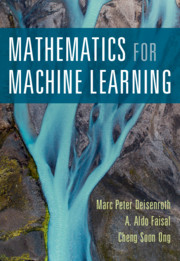

---
---

Please link to this site using [https://mml-book.com](https://mml-book.com).

Twitter: [@mpd37](https://twitter.com/mpd37), [@AnalogAldo](https://twitter.com/analogaldo), [@ChengSoonOng](https://twitter.com/ChengSoonOng).

{:style="float: right"}

We wrote a book on Mathematics for Machine Learning that motivates people to learn mathematical concepts. The book is not intended to cover advanced machine learning techniques because there are already plenty of books doing this. Instead, we aim to provide the necessary mathematical skills to read those other books.

The book will be [published by Cambridge University Press](https://www.cambridge.org/academic/subjects/computer-science/pattern-recognition-and-machine-learning/mathematics-machine-learning?format=PB) in early 2020.

We split the book into two parts:

* Mathematical foundations
* Example machine learning algorithms that use the mathematical foundations

We aim to keep this book fairly short, so we don't cover everything.

**We will keep PDFs of this book freely available after publication.**

## Downloads
### [PDF of the book](book/mml-book.pdf)
This version is the most up-to-date version of the book, i.e., we continue fixing typos etc.
### [PDF of the printed book](book/mml-book_printed.pdf)
This version is equivalent (modulo formatting) with the printed version of the book. GitHub issues starting from 433 are not included in this version.

##  Table of Contents

**Part I: Mathematical Foundations**  

1. **Introduction and Motivation**
2. **Linear Algebra**
3. **Analytic Geometry**
4. **Matrix Decompositions**
5. **Vector Calculus**
6. **Probability and Distribution**
7. **Continuous Optimization**

**Part II: Central Machine Learning Problems**  

{:start="8"}
8. **When Models Meet Data**
9. **Linear Regression**
10. **Dimensionality Reduction with Principal Component Analysis**
11. **Density Estimation with Gaussian Mixture Models**
12. **Classification with Support Vector Machines**

### [Report errata and feedback](https://github.com/mml-book/mml-book.github.io/issues).

We submitted the final draft for copy-editing. Therefore, any issues you raise now may not make it into the printed version.

## Tutorials
We are working on jupyter notebook tutorials for the machine learning parts:

1. [Linear Regression](https://github.com/mml-book/mml-book.github.io/tree/master/tutorials/tutorial_linear_regression.ipynb)
2. [Gaussian Mixture Models](tutorials/tutorial_gmm.ipynb)
3. [PCA](tutorials/tutorial_pca.ipynb)
4. SVM (work in progress)

## Testimonies
'This book provides great coverage of all the basic mathematical concepts for machine learning. I'm looking forward to sharing it with students, colleagues, and anyone interested in building a solid understanding of the fundamentals.'
Joelle Pineau

'The field of machine learning has grown dramatically in recent years, with an increasingly impressive spectrum of successful applications. This comprehensive text covers the key mathematical concepts that underpin modern machine learning, with a focus on linear algebra, calculus, and probability theory. It will prove valuable both as a tutorial for newcomers to the field, and as a reference text for machine learning researchers and engineers.'
Christopher Bishop

'The book hits the right level of detail for me. Too many of the ML books have a "don’t worry your pretty head about this detail" mentality,   or go the other way and overwhelm me with detail. Your book is comprehensive and has a sense of ease and expanse, but it feels like I can get to the application part quickly enough.'
Sriram Srinivasan
