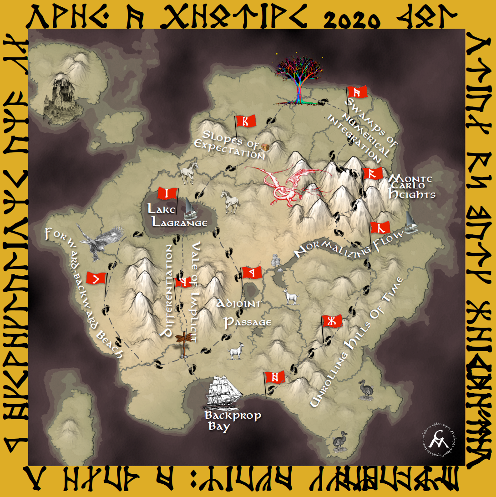

---
---

# There and Back Again: A Tale of Slopes and Expectations

Marc Deisenroth and Cheng Soon Ong

_07 December 2020, NeurIPS 2020 tutorial_ [NeurIPS link](https://neurips.cc/Conferences/2020/Schedule?showEvent=16646)

An introduction to integration and differentiation

Draft notes covering the same topics as the videos below will be available on [arxiv]() soon.

**Video on [slideslive](https://slideslive.com/38935796)**

**One single [playlist](https://www.youtube.com/playlist?list=PL93aLKqThq4h7UpgeNhkOtEeCnX3DMseS)**

1. Overview [video](https://youtu.be/k42AKAlGQAA)
2. Introduction to Integration [video](https://youtu.be/Z14sGSf_QSA) [slides](neurips2020/02-integration.pdf)
3. Numerical Integration [video](https://youtu.be/VTu4dJIIidU) [slides](neurips2020/03-numerical-integration.pdf)
4. Monte Carlo Integration [video](https://youtu.be/SErqkJqO2fI) [slides](neurips2020/04-monte-carlo.pdf)
5. Normalizing Flows [video](https://youtu.be/7TOvhz93G9o) [slides](neurips2020/05-normalizing-flows.pdf)
6. Inference in Time Series [video](https://youtu.be/N4AgbWrJHc4) [slides](neurips2020/06-time-series.pdf)
7. Backpropagation and Automatic Differentiation [video](https://youtu.be/ZUpEm8iJUbE) [slides](neurips2020/07-autodiff.pdf)
8. Forward Backward Algorithm [video](https://youtu.be/ujIbJp9uxRk) [slides](neurips2020/08-forward-backward.pdf)
9. Implicit Function Theorem [video](https://youtu.be/3gcGvsbkijk) [slides](neurips2020/09-implicit-diff.pdf)
10. Method of Adjoints [video](https://youtu.be/jgcQHLKh55c) [slides](neurips2020/10-adjoint.pdf)
11. Method of Lagrange [video](https://youtu.be/rTFWxoa3u-8) [slides](neurips2020/11-lagrange.pdf)
12. Stochastic Gradient Estimators [video](https://youtu.be/7wdIu2dNpY8) [slides](neurips2020/12-stochastic-gradient.pdf)

{:style="text-align: center"}
